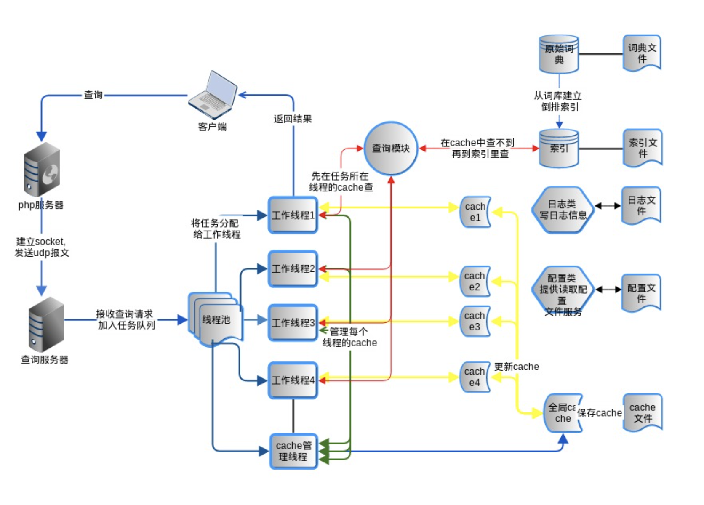
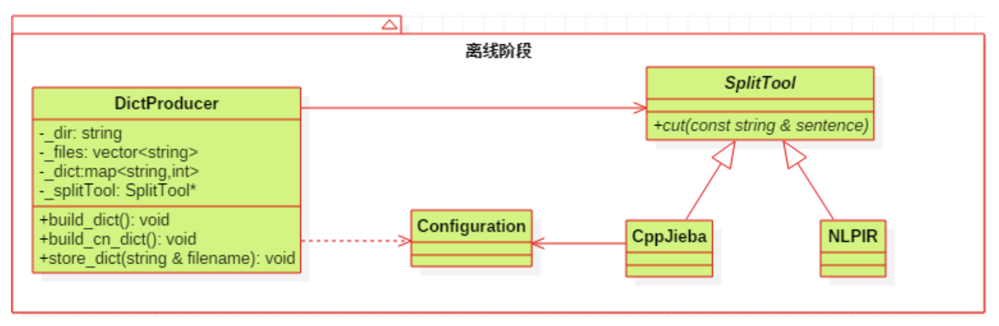
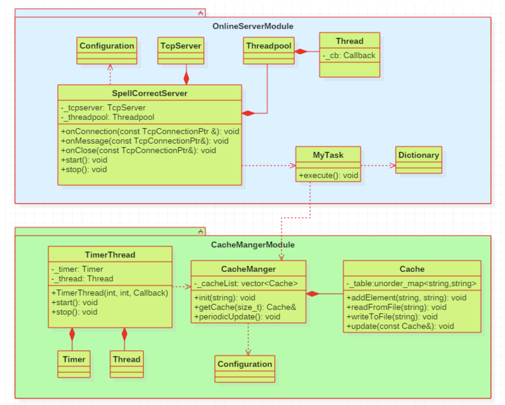

## 用户输入助手__服务端

### 1. 目录结构

````
src
bin
config
log
include
Makefile
````

### 2. 系统运行过程图



### 3. 项目安排

#### 3.1 第一阶段：离线部分

**1) 创建词典**

词典中的每一条记录的格式为：<Word,frequency> 

**2)创建索引文件**

​		查询词query没有必要与所有的候选词来比较，例如，查询词是nike，候选词是appl，这两个词没有任何字符有交集，这种情况没有必要计算编辑距离。如何利用索引来缩小候选词，以达到提高计算性能的目的：当query是nike的时候，我们只需要查找候选词包含n或者i或者k或者e的这些词。

````
n：ipone，iphone
i：ipone，iphone，nike
k：nike，kindle
e：nike，iphone，ipone，kindle
l：loop，appl
s：snoopy
中: 中国 中间  其中
````

#### 3.2 第二阶段：搭框架

​		将线程池，网络编程模块的内容组合起来，形成一个**可测试**的框架。即将客户端传递过来的查询词封装成一个任务，交给线程池处理，最后将处理好的结果直接发送给客户端。	

#### 3.3 第三阶段：业务逻辑

​		获取到客户端传递过来的查询词[对协议进行解析]之后，再从索引之中查找与之相近的候选词，选取到最合适的候选词之后再将其发送给客户端。

​		候选词的选取包括以下几个部分：

```
1）实现最小编辑距离核心算法 ---- 计算候选词与查询词的相似度
2）候选词选择策略：
		a.优先比较最小编辑距离；
		b.在编辑距离相同的条件下，再比较候选词的词频，词频大的优先级更高；
		c.在词频相同的条件下，按字母表顺序比较候选词；
3）获取k个（例如3个）候选词，返回给客户端。（需要使用优先级队列）
```

​		发送给客户端的数据要采用JSON数据格式（开源库jsoncpp）封包，然后采用小火车的私有协议发送给客户端。

```
数据长度(JSON字符串长度int32) 	数据body(JSON字符串)
```

#### 3.4 第四阶段：优化拓展

##### 3.4.1 添加缓存系统

**1）手动实现的LRU置换策略的内存Cache和磁盘Cache**

​		内存 cache就是一个map或者hash_map, 磁盘cache就是一个文件，每次启动时从磁盘读入cache文件来初始化内存cache，在线服务时，每隔10分钟将内存cache回写磁盘（数据持久化）。每个线程一个cache，这些cache的数据就会不一致，轮询写磁盘。

**2）非关系型数据库Redis**

**相关知识：**

Q1. 什么是redis？为什么要使用Redis？如何使用Redis？

​		https://redis.io/ [Redis官网]

​		http://blog.csdn.net/acmman/article/details/53167917 [Redis介绍和使用场景]

​		http://www.runoob.com/redis/redis-install.html [Redis安装]

​		https://github.com/antirez/redis [Redis服务器源码]

​		https://github.com/redis/hiredis [Redis客户端源码C]

​		https://github.com/cylix/cpp_redis [Redis客户端源码C++11]

Q2. Redis的缓存淘汰策略是怎样的？

​		http://ifeve.com/redis-lru/#more-22547 [Redis数据回收策略]

Q3. Redis中的对于冷热数据的处理是如何解决的？

​		http://blog.csdn.net/qq_22884121/article/details/52807395 [冷热数据分离的场景]

​		http://blog.csdn.net/qq_39469761/article/details/74939559 [Redis热数据存储问题]

Q4. Redis的数据抢持久化是怎样的？

​		http://blog.csdn.net/tr1912/article/details/70197085

​		http://ifeve.com/redis-persistence/#more-22664

Q5. Redis事务处理

​		http://ifeve.com/redis-transactions/#more-34508


##### 3.4.2 处理中文数据（UTF8编码）

​		首先需要对中文进行分词，然后再去统计每个词语的词频，建立中文词典和索引，类似英文的处理。对中文进行分词，需要使用开源的分词库，如cppjieba, NLPIR，所以要了解分词库的用法。本项目使用cppjieba.

​		扩展最小编辑距离算法，让其能对中英文进行处理。

##### 3.4.3 使用字典树Trie存储英文词典

### 4. 相关类及其说明

#### 4.1 离线部分

##### 4.1.1 类与类之间的关系



##### 4.1.2 类的主要成员

*Class Configuration(配置文件类)**

数据成员：

| 成员                           | 用途         |
| ------------------------------ | ------------ |
| string　_filepath;             | 配置文件路径 |
| map<string,string> _configMap; | 配置文件内容 |

主要的函数成员：

| 成员                                  | 用途                      |
| ------------------------------------- | ------------------------- |
| Configuration(const string& filepath) | 构造函数                  |
| Map<string,string>  & getConfigMap()  | 获取存放配置文件内容的map |

**Class DictProducer(配置文件类)**

数据成员：

| 成员                    | 用途                     |
| ----------------------- | ------------------------ |
| string　dir_;           | 语料库文件存放路径       |
| vector<string> files_;  | 语料库文件的绝对路径集合 |
| map<string,int> dict_;  | 配置文件内容             |
| SplitTool * splitTool_; | 分词工具                 |

主要的函数成员：

| 成员                                                    | 用途                     |
| ------------------------------------------------------- | ------------------------ |
| DictProducer(const string& dir)                         | 构造函数                 |
| DictProducer(const string& dir, SplitTool  * splitTool) | 构造函数,专为中文处理    |
| void build_dict()                                       | 创建英文字典             |
| void build_cn_dict()                                    | 创建中文字典             |
| void store_dict(const char * filepath)                  | 将词典写入文件           |
| void show_files()const                                  | 查看文件路径，作为测试用 |
| void show_dict()const                                   | 查看词典，作为测试用     |
| void get_files()                                        | 获取文件的绝对路径       |
| void push_dict(const string & word)                     | 存储某个单词             |

**Class SplitTool(分词工具类)**

主要的函数成员：

| 成员                                                    | 用途                         |
| ------------------------------------------------------- | ---------------------------- |
| SplitTool()                                             | 构造函数                     |
| virtual ~SplitTool()                                    | 虚析构函数                   |
| virtual  vector<string> cut(const string &  sentence)=0 | 分词函数，纯虚函数，提供接口 |

**Class SplitToolNLPIR(分词工具类)**

数据成员：

| 成员                   | 用途         |
| ---------------------- | ------------ |
| Configuration & _conf; | 配置文件路径 |
|                        |              |

主要的函数成员：

| 成员                                                   | 用途                         |
| ------------------------------------------------------ | ---------------------------- |
| SplitToolNLPIR()                                       | 构造函数                     |
| virtual ~SplitTool()                                   | 虚析构函数                   |
| virtual vector<string> cut(const  string & sentence)=0 | 分词函数，纯虚函数，提供接口 |

**Class SplitToolCppJieba(分词工具类)**

数据成员：

| 成员                   | 用途         |
| ---------------------- | ------------ |
| Configuration & _conf; | 配置文件路径 |

主要的函数成员：

| 成员                                                   | 用途                         |
| ------------------------------------------------------ | ---------------------------- |
| SplitToolCppJieba()                                    | 构造函数                     |
| virtual ~SplitToolCppJieba()                           | 虚析构函数                   |
| virtual vector<string> cut(const  string & sentence)=0 | 分词函数，纯虚函数，提供接口 |

 

#### 4.2 在线部分

##### 4.2.1类与类之间的关系



##### 4.2.2 类的主要成员

**4.2.2.1 线程池**

**Class Mutex（互斥变量类）**

数据成员：

| 成员                    | 用途     |
| ----------------------- | -------- |
| pthread_mutex_t _mutex; | 互斥变量 |

函数成员：

| 成员                            | 用途                                          |
| ------------------------------- | --------------------------------------------- |
| MutexLock()                     | 构造函数                                      |
| ~MutexLock()                    | 析构函数                                      |
| void lock()                     | 锁函数                                        |
| void unlock()                   | 解锁函数                                      |
| Pthread_mutex_t * getMutexPtr() | 获取原生互斥锁的地址，由Condition对象进行调用 |

**Class Condition(条件变量类)**

数据成员：

| 成员                  | 用途     |
| --------------------- | -------- |
| CMutex&  _mutex       | 词典     |
| pthread_cond_t  _cond | 本类实例 |

函数成员：

| 成员                         | 用途     |
| ---------------------------- | -------- |
| Condition(MutexLock & mutex) | 构造函数 |
| ~Condition()                 | 析构函数 |
| void wait()                  | 等待     |
| void notify()                | 唤醒     |
| void notifyall()             | 唤醒全部 |

**Class TaskQueue（任务队列类）**

数据成员：

| 成员                                | 用途                       |
| ----------------------------------- | -------------------------- |
| MutexLock _mutex;                   | 互斥锁对象                 |
| Condition _notEmpty;                | 任务队列中有数据的条件     |
| Condition _notFull;                 | 任务队列中有空闲空间的条件 |
| typedef std::function<void()> Task; | 任务的回调函数作为接口     |
| size_t _size;                       | 队列大小                   |
| queue<Task> _que;                   | 队列                       |
| bool _flag;                         | 标志位，用于退出pop函数    |

函数成员：

| 成员                | 用途                  |
| ------------------- | --------------------- |
| Buffer(int)         | 构造函数              |
| void empty()        | 判断队列是否为空      |
| void full()         | 判断队列是否已满      |
| void push(Task)     | 往任务队列中添加任务  |
| Task pop()          | 从任务队列中获取任务  |
| void wakeup_empty() | 唤醒_notEmpty条件变量 |

**Class Thread（线程类）**

数据成员：

| 成员                                     | 用途                 |
| ---------------------------------------- | -------------------- |
| pthread_t _pthId;                        | Linux下的线程类型    |
| bool _isRunning;                         | 记录线程是否正在运行 |
| typedef function<void()> ThreadCallback; | 重定义回调函数的标签 |
| ThreadCallback _cb;                      | 执行任务的函数对象   |

函数成员：

| 成员                                | 用途             |
| ----------------------------------- | ---------------- |
| Thread(ThreadCallback cb)           | 构造函数         |
| ~Thread()                           | 析构函数         |
| void start()                        | 线程开始执行     |
| void join()                         | 等待线程执行完毕 |
| static void * threadFunc(void*arg); | 线程的函数执行体 |

Class Threadpool（线程池类）

数据成员：

| 成员                           | 用途                 |
| ------------------------------ | -------------------- |
| int _threadNum;                | Linux下的线程类型    |
| vector<Thread *> _vecThreads;  | 线程对象的容器       |
| int _bufSize;                  | 缓冲区大小           |
| Buffer _buf;                   | 缓冲区对象           |
| typedef function<void()> Task; | 重定义回调函数的标签 |

函数成员：

| 成员                                    | 用途                         |
| --------------------------------------- | ---------------------------- |
| Threadpool(int threadNum, int  bufSize) | 构造函数                     |
| void start()                            | 线程池开始执行               |
| void stop()                             | 停止线程池                   |
| void addTask(Task)                      | 往线程池中添加任务           |
| void threadFunc()                       | 线程池中每个线程的函数执行体 |
| Task getTask()                          | 从缓冲区中获取任务           |

**Class Timer（定时器类）**

数据成员：

| 成员                                    | 用途                   |
| --------------------------------------- | ---------------------- |
| int _timerfd;                           | Linux下的线程类型      |
| bool _isStarted;                        | 记录定时器是否已经开启 |
| typedef function<void()> TimerCallback; | 重定义回调函数的标签   |
| TimerCallback _cb;                      | 执行任务的函数对象     |

函数成员：

| 成员                                                   | 用途       |
| ------------------------------------------------------ | ---------- |
| Timer(int initSec, int intervalSec,  TimerCallback cb) | 构造函数   |
| ~Timer()                                               | 析构函数   |
| void start()                                           | 开启定时器 |
| void stop()                                            | 停止定时器 |
| void handleRead()                                      | 处理定时器 |

**Class TimerThread（定时器线程类）**

数据成员：

| 成员            | 用途 |
| --------------- | ---- |
| Timer _timer;   |      |
| Thread _thread; |      |

函数成员：

| 成员                                                         | 用途       |
| ------------------------------------------------------------ | ---------- |
| TimerThread(int initSec, int  intervalSec, TimerCallback cb) | 构造函数   |
| ~TimerThread()                                               | 析构函数   |
| void start()                                                 | 开启定时器 |
| void stop()                                                  | 停止定时器 |

 

**4.2.2.2网络编程相关类**

**Class InetAddress(网络地址类)**

数据成员：

| 成员                      | 用途                     |
| ------------------------- | ------------------------ |
| struct sockaddr_in _addr; | Linux下的sockaddr_in类型 |

函数成员：

| 成员                                          | 用途                       |
| --------------------------------------------- | -------------------------- |
| InetAddress(unsigned short)                   | 构造函数                   |
| InetAddress(const char *  ip, unsigned short) | 构造函数                   |
| InetAddress(const struct  sockaddr_in & addr) | 构造函数                   |
| string ip() const                             | 从网络地址获取点分十进制ip |
| unsigned short port() const                   | 从网络地址获取端口号       |

 **Class Socket(网络套接字类)**

数据成员：

| 成员          | 用途                     |
| ------------- | ------------------------ |
| int  _sockfd; | Linux下的sockaddr_in类型 |

函数成员：

| 成员                 | 用途               |
| -------------------- | ------------------ |
| Socket()             | 构造函数           |
| Socket(int sockfd)   | 构造函数           |
| void nonblock()      | 设置fd为非阻塞模式 |
| void shutdownWrite() | 关闭套接字的写端   |
| int fd()             | 返回_sockfd        |

 **Class SocketIO(网络IO类)**

数据成员：

| 成员         | 用途                     |
| ------------ | ------------------------ |
| int _sockfd; | Linux下的sockaddr_in类型 |

函数成员：

| 成员                                          | 用途                        |
| --------------------------------------------- | --------------------------- |
| SocketIO(int sockfd)                          | 构造函数                    |
| size_t readline(char * buf, size_t max)       | 从对端读取１行数据          |
| size_t readn(char * buf, size_t count)        | 从对端读取count个字节的数据 |
| size_t writen(const char * buf, size_t count) | 从本地发送数据              |
| size_t recvPeek(char * buf, size_t count)     | 查看内核缓冲区，并获取数据  |

 **Class Acceptor(接收器类)**

数据成员：

| 成员                | 用途                 |
| ------------------- | -------------------- |
| Socket _listensock; | 服务器监听Socket对象 |
| InetAddress _addr;  | 服务器网络地址       |

函数成员：

| 成员                                    | 用途                     |
| --------------------------------------- | ------------------------ |
| Acceptor(int fd, const  InetAddress & ) | 构造函数                 |
| void ready()                            | 服务器监听准备           |
| int accept()                            | 接收新连接               |
| void setReuseAddr(bool on)              | 设置服务器网络地址可重用 |
| size_t setReusePort(bool on)            | 设置服务器网络端口可重用 |
| void bind()                             | 绑定网络地址             |
| void listen()                           | 进行监听                 |

**Class TcpConnection(TCP连接类)**

Typedef std::shared_ptr<TcpConnection> TcpConnectionPtr;

数据成员：

| 成员                                                         | 用途                      |
| ------------------------------------------------------------ | ------------------------- |
| Socket _sockfd;                                              |                           |
| SocketIO _sockIO;                                            |                           |
| const InetAddress _localAddr;                                |                           |
| const InetAddress _peerAddr;                                 |                           |
| bool _isShutdownWrite;                                       |                           |
| typedef function<void (const TcpConnectionPtr &) TcpConnectionCallback; |                           |
| TcpConnectionCallback _onConnectionCb;                       |                           |
| TcpConnectionCallback _onMessageCb;                          |                           |
| TcpConnectionCallback _onCloseCb;                            |                           |
| EpollPoller * _loop;                                         | 保存EpollPoller对象的指针 |

函数成员：

| 成员                                                 | 用途                 |
| ---------------------------------------------------- | -------------------- |
| TcpConnection(int sockfd)                            | 构造函数             |
| ~TcpConnection()                                     | 析构函数             |
| string receive()                                     | 接收数据             |
| void send(const string & msg)                        | 发送数据             |
| void sendInLoop(const string & msg)                  | 将数据交给IO线程发送 |
| void shutdown()                                      | 关闭连接             |
| void setConnectionCallback(TcpConnectionCallback cb) | 设置回调函数         |
| void setMessageCallback(TcpConnectionCallback cb)    | 设置回调函数         |
| void setCloseCallback(TcpConnectionCallback cb)      | 设置回调函数         |
| void handleConnectionCallback()                      | 调用相应的回调函数   |
| void handleMessageCallback()                         | 调用相应的回调函数   |
| void handleCloseCallback()                           | 调用相应的回调函数   |
| string toString()                                    | 返回连接的字符串表示 |

 **Class EpollPoller(epoll封装类)**

数据成员：

| 成员                                                        | 用途                              |
| ----------------------------------------------------------- | --------------------------------- |
| int _epollfd;                                               | Epoll实例的文件描述符             |
| int _listenfd;                                              | 服务器监听文件描述符              |
| bool _isLooping;                                            | 标记是否进行循环                  |
| typedef vector<struct epoll_event> EventList;               |                                   |
| EventList _eventList;                                       | 存储触发事件的fd                  |
| Typedef map<int, TcpConnetionPtr> ConnectionMap;            |                                   |
| ConnectionMap _connMap;                                     | 保存所有已建立的连接              |
| typedef TcpConnection::TcpConnectionCallback EpollCallback; |                                   |
| EpollCallback _onConnectionCb;                              | 回调函数，传递给TcpConnection对象 |
| EpollCallback _onMessageCb;                                 | 回调函数，传递给TcpConnection对象 |
| EpollCallback _onCloseCb;                                   | 回调函数，传递给TcpConnection对象 |
| typedef std::function<void()> Functor;                      | 函数回调重定义                    |
| Vector<Functor> _pendingFunctors;                           | 需要延迟执行的回调函数            |

函数成员：

| 成员                                         | 用途                     |
| -------------------------------------------- | ------------------------ |
| EpollPoller(int listenfd)                    | 构造函数                 |
| ~EpollPoller()                               | 析构函数                 |
| void loop()                                  | 执行事件循环             |
| void unloop()                                | 退出事件循环             |
| void runInLoop(const Functor & cb)           | 向IO线程发送数据         |
| void setConnectionCallback(EpollCallback cb) | 设置回调函数             |
| void setMessageCallback(EpollCallback cb)    | 设置回调函数             |
| void setCloseCallback(EpollCallback cb)      | 设置回调函数             |
| void wakeup()                                | 激活_eventfd(执行写操作) |
| void waitEpollfd()                           | 执行事件循环,由loop调用  |
| void handleConnection()                      | 处理新连接               |
| void handleMessage(int peerfd)               | 处理旧连接（信息）       |
| void handleRead()                            | 处理_eventfd(执行读操作) |
| void doPendingFunctors()                     | 执行回调函数             |

 **Class TcpServer(Tcp服务器类)**

数据成员：

| 成员                                                         | 用途                            |
| ------------------------------------------------------------ | ------------------------------- |
| Acceptor _acceptor;                                          | 服务端接收器                    |
| EpollPoller _epollfd;                                        | EpollPoller 对象                |
| typedef TcpConnection::TcpConnectionCallback TcpServerCallback; |                                 |
| TcpServerCallback _onConnectionCb;                           | 回调函数，传递给EpollPoller对象 |
| TcpServerCallback _onMessageCb;                              | 回调函数，传递给EpollPoller对象 |
| TcpServerCallback _onCloseCb;                                | 回调函数，传递给EpollPoller对象 |

函数成员：

| 成员                                             | 用途         |
| ------------------------------------------------ | ------------ |
| TcpServer(unsigned short  port)                  | 构造函数     |
| TcpServer(const char *  ip,unsigned short port)  | 构造函数     |
| void start()                                     | 开始服务     |
| void stop()                                      | 停止服务     |
| void setConnectionCallback(TcpServerCallback cb) | 设置回调函数 |
| void setMessageCallback(TcpServerCallback cb)    | 设置回调函数 |
| void setCloseCallback(TcpServerCallback cb)      | 设置回调函数 |

**4.2.4业务类**

**Class SpellcorrectServer（文本纠错类）**

数据成员：

| 成员                    | 用途         |
| ----------------------- | ------------ |
| MyConf & _conf;         | 配置文件对象 |
| TcpServer _tcpServer;   | 网络编程对象 |
| Threadpool _threadpool; | 线程池对象   |

函数成员：

| 成员                                                    | 用途                                |
| ------------------------------------------------------- | ----------------------------------- |
| SpellCorrectServer(const string &          cfgFileName) | 构造函数                            |
| void start()                                            | 开始提供服务                        |
| void onConnection(TcpConnectionPtr conn)                | 被注册回调函数，提供给TcpServer使用 |
| void onMessage(TcpConnectionPtr conn)                   | 被注册回调函数，提供给TcpServer使用 |
| void onClose(TcpConnectionPtr conn)                     | 被注册回调函数，提供给TcpServer使用 |

**Class Mydict（词典类－单例模式）**

数据成员：

| 成员                                 | 用途   |
| ------------------------------------ | ------ |
| vector<pair<string,int>> _dict；     | 词典   |
| map<string,set<int>>　_index_table； | 索引表 |

 函数成员：

| 成员                                                         | 用途                                 |
| ------------------------------------------------------------ | ------------------------------------ |
| static MyDict * createInstance()                             | 静态函数                             |
| void init (const char * dictEnPath,const  char * dictCnPath) | 通过中文和英文词典文件路径初始化词典 |
| vector<pair<string, int> > & getDict()                       | 获取词典                             |
| map<string, set<int> > & getIndexTable()                     | 获取索引表                           |

**Class MyTask(任务类)**

数据成员：

| 成员                                                         | 用途                         |
| ------------------------------------------------------------ | ---------------------------- |
| string　_queryWord;                                          | 等查询的单词                 |
| int _peerfd;                                                 | 与客户端进行连接的文件描述符 |
| Priority_queue<MyResult,           vector<MyResult>,         MyCompare>     _resultQue; | 保存候选结果集的优先级队列   |

主要的函数成员：

| 成员                                        | 用途             |
| ------------------------------------------- | ---------------- |
| MyTask(const string& queryWord, int peerfd) | 构造函数         |
| void execute(Cache & cache)                 | 执行查询         |
| void queryIndexTable()                      | 查询索引         |
| void statistic(set<int> &  iset)            | 进行计算         |
| int distance(const string & rhs)            | 计算最小编辑距离 |
| void response(Cache & cache)                | 响应客户端的请求 |

 